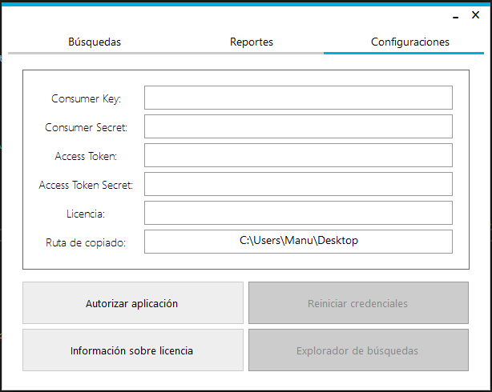
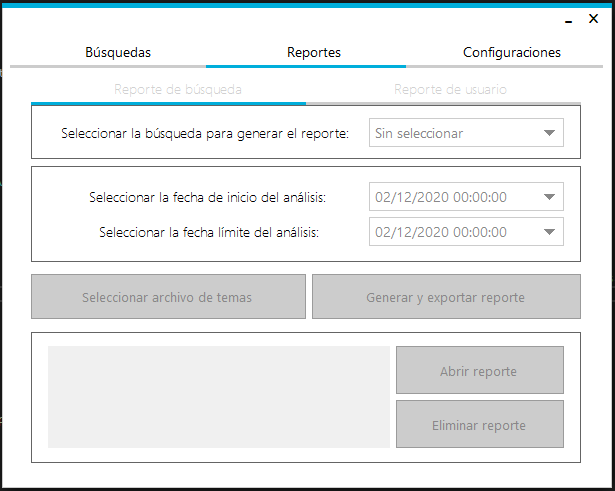
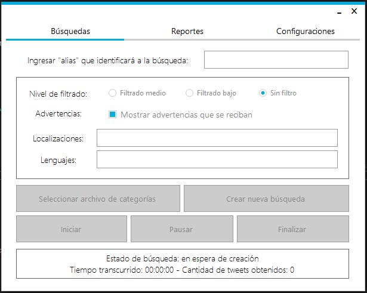

# [C# | .NET] Twitter Tools

Twitter Tools is a Windows Forms Application that lets you search for tweets that contains certain words in it and save them so you can generate reports about these searchs later on.

An example of a license would be: UzMHnooH5V3JZmgqkMEH0so4tundiud3cMt60Sa23UAEcXrs4S4KHde7iDylaY/b8RmQiV98ehQ=

## Images

### Configuration tab

### Report tab

### Search tab
